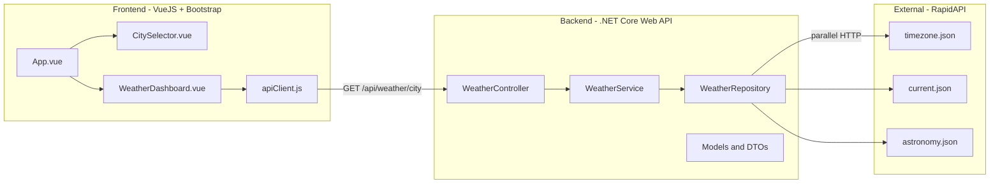

# Full Stack Weather Application Plan

## Architecture Overview




**Pattern**: Repository-Service pattern. The Repository handles raw HTTP communication with RapidAPI and deserializes to strongly-typed External DTOs. The Service handles business logic, parallel orchestration, mapping to public DTOs, caching, and city validation from configuration. Cross-cutting concerns (resilience via Polly, error formatting via IExceptionHandler) are handled in middleware/DI.

---

## Project Structure

```
CircitCodingChallenge/
├── WeatherApi/                         # .NET Core Web API
│   ├── Controllers/
│   │   └── WeatherController.cs
│   ├── Services/
│   │   ├── IWeatherService.cs
│   │   └── WeatherService.cs
│   ├── Repositories/
│   │   ├── IWeatherRepository.cs
│   │   └── WeatherRepository.cs
│   ├── Models/
│   │   ├── External/                   # Mirror RapidAPI JSON structures
│   │   │   ├── ExternalCurrentWeatherDto.cs
│   │   │   ├── ExternalTimezoneDto.cs
│   │   │   └── ExternalAstronomyDto.cs
│   │   └── WeatherResponse.cs          # Unified public DTO
│   ├── Configuration/
│   │   └── RapidApiSettings.cs         # Options class (incl. AllowedCities)
│   ├── Exceptions/
│   │   ├── CityNotFoundException.cs
│   │   └── ExternalApiException.cs
│   ├── Middleware/
│   │   └── GlobalExceptionHandler.cs   # IExceptionHandler -> Problem Details
│   ├── Program.cs
│   ├── appsettings.json
│   └── WeatherApi.csproj
├── WeatherApi.Tests/                   # xUnit test project
│   ├── Services/
│   │   └── WeatherServiceTests.cs
│   ├── Controllers/
│   │   └── WeatherControllerTests.cs
│   └── WeatherApi.Tests.csproj
├── weather-client/                     # Vue 3 + Vite + Bootstrap
│   ├── src/
│   │   ├── components/
│   │   │   ├── CitySelector.vue
│   │   │   └── WeatherDashboard.vue
│   │   ├── services/
│   │   │   └── apiClient.js
│   │   └── App.vue
│   ├── package.json
│   └── vite.config.js
├── CircitCodingChallenge.sln
├── README.md
└── .gitignore
```

---

## Backend Details (.NET 8)

### Configuration (`appsettings.json`)

- `RapidApi:BaseUrl` = `https://weatherapi-com.p.rapidapi.com`
- `RapidApi:ApiKey` = `6b24bd0214mshd015cb8b7d427cap1a45f2jsn5fa2a0a67801`
- `RapidApi:ApiHost` = `weatherapi-com.p.rapidapi.com`
- `RapidApi:AllowedCities` = `["Cracow", "Warsaw", "Dublin"]` (OCP: add cities without recompilation)
- `RapidApi:CacheTtlMinutes` = `10`
- Bind to a strongly-typed `RapidApiSettings` class via `IOptions<RapidApiSettings>`

### Repository Layer (`IWeatherRepository` / `WeatherRepository`)

- Uses `HttpClient` (registered via `IHttpClientFactory`) with base address and default headers (`X-RapidAPI-Key`, `X-RapidAPI-Host`) configured in DI
- **Polly resilience** applied at HttpClient registration level (see Resilience section below)
- Three methods: `GetCurrentWeatherAsync(city)`, `GetTimezoneAsync(city)`, `GetAstronomyAsync(city)`
- Each deserializes to **strongly-typed External DTOs** (`ExternalCurrentWeatherDto`, `ExternalTimezoneDto`, `ExternalAstronomyDto`) — mirrors the RapidAPI JSON structure with `[JsonPropertyName]` attributes
- On non-success HTTP status, throws `ExternalApiException` with status code and message

### External DTOs (`Models/External/`)

Strongly-typed classes mirroring the RapidAPI response JSON:

- `ExternalCurrentWeatherDto` — `location` object, `current` object (temp_c, temp_f, condition, humidity, wind_kph, feelslike_c, uv)
- `ExternalTimezoneDto` — `location` object with tz_id, utc_offset, localtime
- `ExternalAstronomyDto` — `location` object, `astronomy.astro` object (sunrise, sunset, moonrise, moonset, moon_phase)

### Service Layer (`IWeatherService` / `WeatherService`)

- Depends on: `IWeatherRepository`, `IOptions<RapidApiSettings>`, `IMemoryCache`, `ILogger<WeatherService>`
- `GetWeatherDataAsync(string city)`:
  1. Validates city against `RapidApiSettings.AllowedCities` (case-insensitive) — throws `CityNotFoundException` if not found
  2. Checks `IMemoryCache` with key `weather_{city_lower}` — returns cached result if available
  3. Fires 3 repository calls in parallel via `Task.WhenAll`
  4. Maps External DTOs to unified public `WeatherResponse` DTO
  5. Stores result in cache with `CacheTtlMinutes` expiration (sliding)
- `GetAllowedCitiesAsync()` — returns the list from configuration
- No try/catch — lets exceptions propagate to `GlobalExceptionHandler`

### Public DTO (`WeatherResponse`)

Unified, clean model hiding RapidAPI internals:

- `Location`: Name, Country, Latitude, Longitude, LocalTime
- `CurrentWeather`: TempC, TempF, Condition (text + icon URL), Humidity, WindKph, FeelsLikeC, UV
- `Timezone`: TimezoneName, UtcOffset
- `Astronomy`: Sunrise, Sunset, Moonrise, Moonset, MoonPhase

### Custom Exceptions (`Exceptions/`)

- `CityNotFoundException` : inherits `Exception` — thrown when city is not in AllowedCities
- `ExternalApiException` : inherits `Exception` — thrown when RapidAPI returns non-success status; contains `HttpStatusCode` property

### Global Exception Handler (`Middleware/GlobalExceptionHandler.cs`)

Implements `IExceptionHandler` (new in .NET 8):

```csharp
public class GlobalExceptionHandler : IExceptionHandler
{
    public async ValueTask<bool> TryHandleAsync(
        HttpContext context, Exception exception, CancellationToken ct)
    {
        var problemDetails = exception switch
        {
            CityNotFoundException e => new ProblemDetails
            {
                Status = 400,
                Title = "City Not Found",
                Detail = e.Message
            },
            ExternalApiException e => new ProblemDetails
            {
                Status = 502,
                Title = "External API Error",
                Detail = e.Message
            },
            _ => new ProblemDetails
            {
                Status = 500,
                Title = "Internal Server Error",
                Detail = "An unexpected error occurred."
            }
        };

        context.Response.StatusCode = problemDetails.Status!.Value;
        await context.Response.WriteAsJsonAsync(problemDetails, ct);
        return true;
    }
}
```

Registered in `Program.cs`:

- `builder.Services.AddExceptionHandler<GlobalExceptionHandler>();`
- `builder.Services.AddProblemDetails();`
- `app.UseExceptionHandler();`

### Resilience with Polly (`Program.cs`)

Using `Microsoft.Extensions.Http.Resilience` (ships with .NET 8):

```csharp
builder.Services.AddHttpClient("RapidApi", client =>
{
    client.BaseAddress = new Uri(settings.BaseUrl);
    client.DefaultRequestHeaders.Add("X-RapidAPI-Key", settings.ApiKey);
    client.DefaultRequestHeaders.Add("X-RapidAPI-Host", settings.ApiHost);
})
.AddStandardResilienceHandler(options =>
{
    options.Retry.MaxRetryAttempts = 3;
    options.Retry.Delay = TimeSpan.FromMilliseconds(500);
    options.Retry.BackoffType = DelayBackoffType.Exponential;
    options.CircuitBreaker.SamplingDuration = TimeSpan.FromSeconds(30);
    options.AttemptTimeout.Timeout = TimeSpan.FromSeconds(5);
});
```

This provides out of the box: retry with exponential backoff, circuit breaker, and per-attempt timeout — all configured declaratively at the DI level, not scattered in business code.

### Controller (`WeatherController`)

- `GET /api/weather/{city}` — calls `IWeatherService.GetWeatherDataAsync(city)`, returns 200 with DTO. Errors are handled by `GlobalExceptionHandler` (no try/catch in controller)
- `GET /api/weather/cities` — calls `IWeatherService.GetAllowedCitiesAsync()`, returns 200 with list of city names (frontend fetches this instead of hardcoding)
- CORS configured in `Program.cs` to allow Vue dev server (`http://localhost:5173`)

---

## Frontend Details (Vue 3 + Vite)

### `apiClient.js`

- Axios instance with `baseURL` pointing to the .NET backend (`http://localhost:5000/api`)
- Single method `getWeather(city)` returning the unified DTO

### `CitySelector.vue`

- Fetches allowed cities from `GET /api/weather/cities` on mount (not hardcoded)
- Bootstrap-styled card/button group
- Emits `city-selected` event

### `WeatherDashboard.vue`

- Receives selected city as prop, calls `apiClient.getWeather(city)`
- Displays weather, timezone, and astronomy in Bootstrap cards
- Loading spinner state and error state handling

### `App.vue`

- Composes `CitySelector` and `WeatherDashboard`
- Manages selected city state

---

## Testing (xUnit + Moq)

### `WeatherServiceTests.cs`

- Mock `IWeatherRepository` to return strongly-typed External DTOs
- Mock `IMemoryCache` to test cache hit/miss paths
- Mock `IOptions<RapidApiSettings>` with test city list
- Test that `GetWeatherDataAsync` correctly maps External DTOs to public DTO
- Test that invalid city throws `CityNotFoundException`
- Test that `ExternalApiException` from repository propagates correctly
- Test cache is populated after first call

### `WeatherControllerTests.cs`

- Mock `IWeatherService`
- Test 200 response with valid city
- Test that controller does not catch exceptions (delegates to GlobalExceptionHandler)

---

## Step-by-Step Execution Order

1. **Scaffolding**: Create .NET solution, Web API project (+ NuGet: `Microsoft.Extensions.Http.Resilience`), xUnit test project (+ Moq), Vue app, `.gitignore`
2. **Backend config**: `appsettings.json` (incl. AllowedCities, CacheTtlMinutes), `RapidApiSettings.cs`, DI setup in `Program.cs` (HttpClient + Polly, IMemoryCache, IExceptionHandler)
3. **Models**: External DTOs (`Models/External/`) + public `WeatherResponse` DTO + custom exceptions (`Exceptions/`)
4. **Global error handling**: `GlobalExceptionHandler` implementing `IExceptionHandler`, mapping to Problem Details
5. **Repository layer**: `IWeatherRepository`, `WeatherRepository` — returns strongly-typed External DTOs
6. **Service layer**: `IWeatherService`, `WeatherService` — parallel calls, mapping, cache, city validation from config
7. **Controller**: `WeatherController` with CORS (no try/catch, delegates errors to middleware)
8. **Unit tests**: xUnit + Moq for service (mapping, cache, exceptions) and controller
9. **Frontend**: Vue 3 components with Bootstrap — CitySelector fetches cities from API, WeatherDashboard shows data
10. **Integration**: CORS config, Vite proxy, end-to-end verification
11. **README.md**: Setup instructions, architecture description

